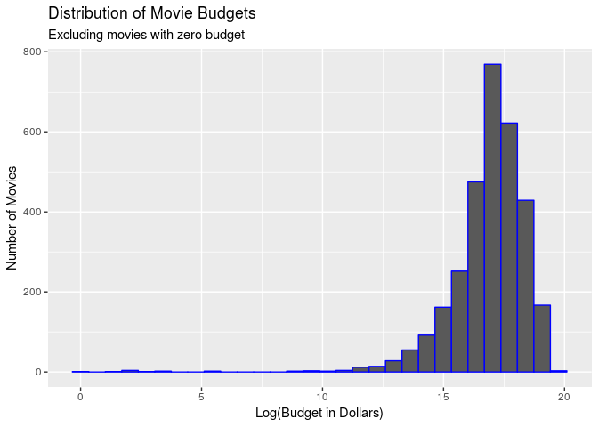

Statistical Playground
================

``` r
library(tidyverse)
```

    ## ── Attaching packages ──────────────────────────────────────────────────────────────────────── tidyverse 1.2.1 ──

    ## ✔ ggplot2 3.1.0     ✔ purrr   0.2.5
    ## ✔ tibble  2.0.0     ✔ dplyr   0.7.8
    ## ✔ tidyr   0.8.2     ✔ stringr 1.3.1
    ## ✔ readr   1.3.1     ✔ forcats 0.3.0

    ## ── Conflicts ─────────────────────────────────────────────────────────────────────────── tidyverse_conflicts() ──
    ## ✖ dplyr::filter() masks stats::filter()
    ## ✖ dplyr::lag()    masks stats::lag()

``` r
library(infer)
```

``` r
movies <- read_csv("/cloud/project/data/tmdb_5000_movies.csv")
```

    ## Parsed with column specification:
    ## cols(
    ##   .default = col_character(),
    ##   budget = col_double(),
    ##   id = col_double(),
    ##   popularity = col_double(),
    ##   release_date = col_date(format = ""),
    ##   revenue = col_double(),
    ##   runtime = col_double(),
    ##   vote_average = col_double(),
    ##   vote_count = col_double()
    ## )

    ## See spec(...) for full column specifications.

``` r
movies <- movies %>%
  filter(original_language == "en")
glimpse(movies)
```

    ## Observations: 4,505
    ## Variables: 20
    ## $ budget               <dbl> 2.37e+08, 3.00e+08, 2.45e+08, 2.50e+08, 2.6…
    ## $ genres               <chr> "[{\"id\": 28, \"name\": \"Action\"}, {\"id…
    ## $ homepage             <chr> "http://www.avatarmovie.com/", "http://disn…
    ## $ id                   <dbl> 19995, 285, 206647, 49026, 49529, 559, 3875…
    ## $ keywords             <chr> "[{\"id\": 1463, \"name\": \"culture clash\…
    ## $ original_language    <chr> "en", "en", "en", "en", "en", "en", "en", "…
    ## $ original_title       <chr> "Avatar", "Pirates of the Caribbean: At Wor…
    ## $ overview             <chr> "In the 22nd century, a paraplegic Marine i…
    ## $ popularity           <dbl> 150.43758, 139.08262, 107.37679, 112.31295,…
    ## $ production_companies <chr> "[{\"name\": \"Ingenious Film Partners\", \…
    ## $ production_countries <chr> "[{\"iso_3166_1\": \"US\", \"name\": \"Unit…
    ## $ release_date         <date> 2009-12-10, 2007-05-19, 2015-10-26, 2012-0…
    ## $ revenue              <dbl> 2787965087, 961000000, 880674609, 108493909…
    ## $ runtime              <dbl> 162, 169, 148, 165, 132, 139, 100, 141, 153…
    ## $ spoken_languages     <chr> "[{\"iso_639_1\": \"en\", \"name\": \"Engli…
    ## $ status               <chr> "Released", "Released", "Released", "Releas…
    ## $ tagline              <chr> "Enter the World of Pandora.", "At the end …
    ## $ title                <chr> "Avatar", "Pirates of the Caribbean: At Wor…
    ## $ vote_average         <dbl> 7.2, 6.9, 6.3, 7.6, 6.1, 5.9, 7.4, 7.3, 7.4…
    ## $ vote_count           <dbl> 11800, 4500, 4466, 9106, 2124, 3576, 3330, …

``` r
movies <- movies %>%
  filter(budget != 0 & revenue != 0) %>%
  mutate(logbudget = log(budget))
movies %>%
  ggplot(mapping = aes(x = logbudget)) +
  geom_histogram(color = "blue") +
  labs(title = "Distribution of Movie Budgets", subtitle = "Excluding movies with zero budget",
       x = "Log(Budget in Dollars)",y = "Number of Movies") 
```

    ## `stat_bin()` using `bins = 30`. Pick better value with `binwidth`.

<!-- -->

``` r
movies %>%
  select(budget, logbudget, original_title) %>%
  arrange(budget)
```

    ## # A tibble: 3,102 x 3
    ##    budget logbudget original_title    
    ##     <dbl>     <dbl> <chr>             
    ##  1      1      0    Modern Times      
    ##  2      4      1.39 A Farewell to Arms
    ##  3      7      1.95 Split Second      
    ##  4      7      1.95 Bran Nue Dae      
    ##  5      8      2.08 The Prophecy      
    ##  6     10      2.30 Nurse 3-D         
    ##  7     11      2.40 F.I.S.T.          
    ##  8     25      3.22 Angela's Ashes    
    ##  9     28      3.33 The 51st State    
    ## 10    218      5.38 Tarnation         
    ## # … with 3,092 more rows
