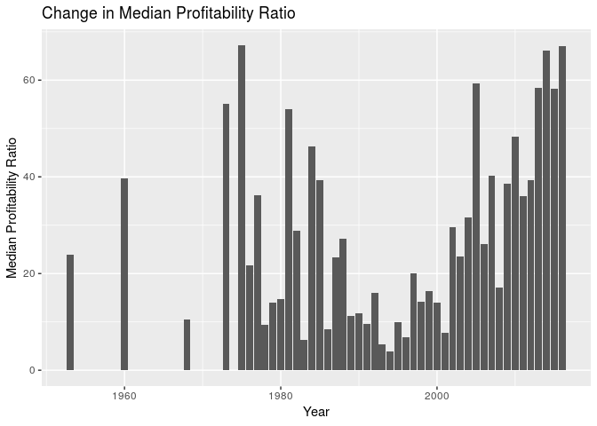

PROJECT TITLE
================
Zuck(R)berg
25 April 2019

Your project goes here\! Before you submit, make sure your chunks are
turned off with `echo = FALSE`.

You can add sections as you see fit. Make sure you have a section called
Introduction at the beginning and a section called Conclusion at the
end. The rest is up to you\!

### Introduction

### Stuff

For our dataset of 5000 movies, we decided to remove the variables id,
homepage, and original\_title, since we felt that these variables did
not contribute to our research question of what contributed to a
“successful” movie. Additionally, since we found problems with the
budget and revenue variables of non-American movies (not in US dollars),
we decided to filter for only english movies as a proxy for American
movies. (Since there is no definite way to filter for only American
movies). We also filtered for movies that had a budget and revenue that
were nonzero, this is so that our data would not be skewed by movies
that were not intended to draw revenue or were not of the same budget
caliber of the rest of the films.

<!-- -->

    ## # A tibble: 10 x 2
    ##    title                                                  popularity
    ##    <chr>                                                       <dbl>
    ##  1 Minions                                                      876.
    ##  2 Interstellar                                                 724.
    ##  3 Deadpool                                                     515.
    ##  4 Guardians of the Galaxy                                      481.
    ##  5 Mad Max: Fury Road                                           434.
    ##  6 Jurassic World                                               419.
    ##  7 Pirates of the Caribbean: The Curse of the Black Pearl       272.
    ##  8 Dawn of the Planet of the Apes                               244.
    ##  9 The Hunger Games: Mockingjay - Part 1                        206.
    ## 10 Big Hero 6                                                   204.

We are going to not look at popularity because we can’t figure out where
this came from,,, etc explain this.

    ## # A tibble: 10 x 2
    ##    title                                          budget
    ##    <chr>                                           <dbl>
    ##  1 Pirates of the Caribbean: On Stranger Tides 380000000
    ##  2 Pirates of the Caribbean: At World's End    300000000
    ##  3 Avengers: Age of Ultron                     280000000
    ##  4 Superman Returns                            270000000
    ##  5 John Carter                                 260000000
    ##  6 Tangled                                     260000000
    ##  7 Spider-Man 3                                258000000
    ##  8 The Lone Ranger                             255000000
    ##  9 The Dark Knight Rises                       250000000
    ## 10 Harry Potter and the Half-Blood Prince      250000000

    ## # A tibble: 2,516 x 1
    ##    production_companies                                                    
    ##    <chr>                                                                   
    ##  1 "[{\"name\": \"Ingenious Film Partners\", \"id\": 289}, {\"name\": \"Tw…
    ##  2 "[{\"name\": \"Walt Disney Pictures\", \"id\": 2}, {\"name\": \"Jerry B…
    ##  3 "[{\"name\": \"Columbia Pictures\", \"id\": 5}, {\"name\": \"Danjaq\", …
    ##  4 "[{\"name\": \"Legendary Pictures\", \"id\": 923}, {\"name\": \"Warner …
    ##  5 "[{\"name\": \"Walt Disney Pictures\", \"id\": 2}]"                     
    ##  6 "[{\"name\": \"Columbia Pictures\", \"id\": 5}, {\"name\": \"Laura Zisk…
    ##  7 "[{\"name\": \"Walt Disney Pictures\", \"id\": 2}, {\"name\": \"Walt Di…
    ##  8 "[{\"name\": \"Marvel Studios\", \"id\": 420}, {\"name\": \"Prime Focus…
    ##  9 "[{\"name\": \"Warner Bros.\", \"id\": 6194}, {\"name\": \"Heyday Films…
    ## 10 "[{\"name\": \"DC Comics\", \"id\": 429}, {\"name\": \"Atlas Entertainm…
    ## # … with 2,506 more rows

### Creating a “Profitability” Variables

The first profitability variable is a ratio of revenue to budget, to
show by what percentage a movie was “profitable.” This second
profitability variable is a categorical variable that deciphers if the
movie was profitable or not, based on the profitiability ratio. If the
ratio was greater than 1, it was considered profitable. It will simply
say “yes” for profitable, and “no” for non-profitable.

### Making a Categorical “spoken languages” Variable

Here, we will be creating a new vategorical variable, that signifies if
the only language spoken in the film is english, or not. If the only
spoken language is english, the value will be “yes,” if there are other
languages spoken or english is not used, the value will be “no.”

### Splitting date variable

    ## # A tibble: 3,086 x 23
    ##    budget genres keywords original_langua… overview popularity
    ##     <dbl> <chr>  <chr>    <chr>            <chr>         <dbl>
    ##  1 2.37e8 "[{\"… "[{\"id… en               In the …      150. 
    ##  2 3.00e8 "[{\"… "[{\"id… en               Captain…      139. 
    ##  3 2.45e8 "[{\"… "[{\"id… en               A crypt…      107. 
    ##  4 2.50e8 "[{\"… "[{\"id… en               Followi…      112. 
    ##  5 2.60e8 "[{\"… "[{\"id… en               John Ca…       43.9
    ##  6 2.58e8 "[{\"… "[{\"id… en               The see…      116. 
    ##  7 2.60e8 "[{\"… "[{\"id… en               When th…       48.7
    ##  8 2.80e8 "[{\"… "[{\"id… en               When To…      134. 
    ##  9 2.50e8 "[{\"… "[{\"id… en               As Harr…       98.9
    ## 10 2.50e8 "[{\"… "[{\"id… en               Fearing…      156. 
    ## # … with 3,076 more rows, and 17 more variables:
    ## #   production_companies <chr>, production_countries <chr>, year <dbl>,
    ## #   month <dbl>, day <dbl>, revenue <dbl>, runtime <dbl>,
    ## #   spoken_languages <chr>, status <chr>, tagline <chr>, title <chr>,
    ## #   vote_average <dbl>, vote_count <dbl>, pratio <dbl>, profit <chr>,
    ## #   spokenlength <int>, english <chr>

### Genre trends

<!-- -->

<!-- -->

### Conclusion
