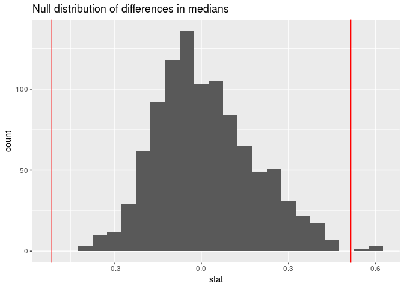
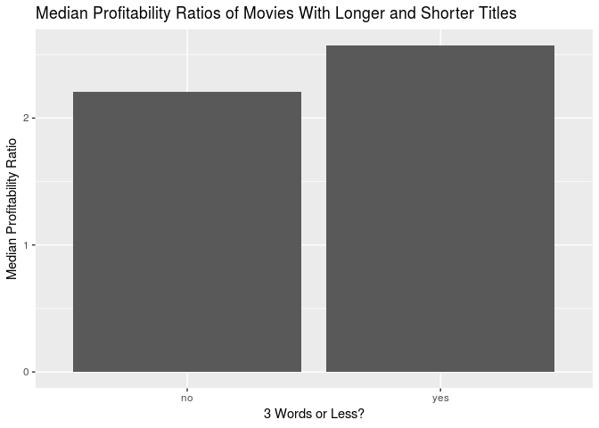

PROJECT TITLE
================
Zuck(R)berg
25 April 2019

Your project goes here\! Before you submit, make sure your chunks are
turned off with `echo = FALSE`.

You can add sections as you see fit. Make sure you have a section called
Introduction at the beginning and a section called Conclusion at the
end. The rest is up to you\!

### Introduction

The movie industry is one that accounts for billions of dollars in
revenue and forms the keystone of the entertainment sector;
consequently, there are a wide variety of films that have had varying
degrees of success in the market. There are a variety of characteristics
and factors that make up a movie – budget, director, etc. – yet none of
these factors alone seem to have the power to drive a successful film.
Rather, a combination of positive factors must be achieved to dominate
the market. In this project, we will be attempting to address the
research question of what specific factors have the most effect in
predicting the profitability of a film.

### Stuff

For our dataset of 5000 movies, we decided to remove the variables id,
homepage, and original\_title, since we felt that these variables did
not contribute to our research question of what contributed to a
“successful” movie. Additionally, since we found problems with the
budget and revenue variables of non-American movies (not in US dollars),
we decided to filter for only english movies as a proxy for American
movies. (Since there is no definite way to filter for only American
movies). We also filtered for movies that had a budget and revenue that
were nonzero, this is so that our data would not be skewed by movies
that were not intended to draw revenue or were not of the same budget
caliber of the rest of the films.

<!-- -->

    ## # A tibble: 10 x 2
    ##    title                                                  popularity
    ##    <chr>                                                       <dbl>
    ##  1 Minions                                                      876.
    ##  2 Interstellar                                                 724.
    ##  3 Deadpool                                                     515.
    ##  4 Guardians of the Galaxy                                      481.
    ##  5 Mad Max: Fury Road                                           434.
    ##  6 Jurassic World                                               419.
    ##  7 Pirates of the Caribbean: The Curse of the Black Pearl       272.
    ##  8 Dawn of the Planet of the Apes                               244.
    ##  9 The Hunger Games: Mockingjay - Part 1                        206.
    ## 10 Big Hero 6                                                   204.

We are going to not look at popularity because we can’t figure out where
this came from,,, etc explain this.

    ## # A tibble: 10 x 2
    ##    title                                          budget
    ##    <chr>                                           <dbl>
    ##  1 Pirates of the Caribbean: On Stranger Tides 380000000
    ##  2 Pirates of the Caribbean: At World's End    300000000
    ##  3 Avengers: Age of Ultron                     280000000
    ##  4 Superman Returns                            270000000
    ##  5 John Carter                                 260000000
    ##  6 Tangled                                     260000000
    ##  7 Spider-Man 3                                258000000
    ##  8 The Lone Ranger                             255000000
    ##  9 The Dark Knight Rises                       250000000
    ## 10 Harry Potter and the Half-Blood Prince      250000000

    ## # A tibble: 2,516 x 1
    ##    production_companies                                                    
    ##    <chr>                                                                   
    ##  1 "[{\"name\": \"Ingenious Film Partners\", \"id\": 289}, {\"name\": \"Tw…
    ##  2 "[{\"name\": \"Walt Disney Pictures\", \"id\": 2}, {\"name\": \"Jerry B…
    ##  3 "[{\"name\": \"Columbia Pictures\", \"id\": 5}, {\"name\": \"Danjaq\", …
    ##  4 "[{\"name\": \"Legendary Pictures\", \"id\": 923}, {\"name\": \"Warner …
    ##  5 "[{\"name\": \"Walt Disney Pictures\", \"id\": 2}]"                     
    ##  6 "[{\"name\": \"Columbia Pictures\", \"id\": 5}, {\"name\": \"Laura Zisk…
    ##  7 "[{\"name\": \"Walt Disney Pictures\", \"id\": 2}, {\"name\": \"Walt Di…
    ##  8 "[{\"name\": \"Marvel Studios\", \"id\": 420}, {\"name\": \"Prime Focus…
    ##  9 "[{\"name\": \"Warner Bros.\", \"id\": 6194}, {\"name\": \"Heyday Films…
    ## 10 "[{\"name\": \"DC Comics\", \"id\": 429}, {\"name\": \"Atlas Entertainm…
    ## # … with 2,506 more rows

### Creating a “Profitability” Variables

The first profitability variable is a ratio of revenue to budget, to
show by what percentage a movie was “profitable.” This second
profitability variable is a categorical variable that deciphers if the
movie was profitable or not, based on the profitiability ratio. If the
ratio was greater than 1, it was considered profitable. It will simply
say “yes” for profitable, and “no” for non-profitable.

To find the 95% confidence interval of pratio:

    ## # A tibble: 1 x 2
    ##   lower uppper
    ##   <dbl>  <dbl>
    ## 1  2.20   2.39

Insert narrative about confidence interval:

### Making a Categorical “spoken languages” Variable

Here, we will be creating a new vategorical variable, that signifies if
the only language spoken in the film is english, or not. If the only
spoken language is english, the value will be “yes,” if there are other
languages spoken or english is not used, the value will be “no.”

### Splitting date variable

^^this code chunk should perhaps go somewhere else but insert quick
narrative saying how we transformed dates from year-mo-da character form
to numerical separate variables

### Genre trends

We wanted to explore how genre affects certain trends within the
dataset. Thus we created a few genre related variables that we thought
would yield the most effect.

    ## # A tibble: 2 x 2
    ##   horror `median(budget)`
    ##   <chr>             <dbl>
    ## 1 no             30000000
    ## 2 yes            14500000

We chose the horror genre since we found that horror movies
significantly have lower budgets, to see if horror movies then have
higher pratios since they have less money to make to “break even” and
make a profit. Also, some of the most profitable movies have been horror
movies, such as Paranormal Activity, that had a very low budget.

We then tested the question: Does this data provide convincing evidence
of a difference in median pratios for horror vs non horror movies?

Null Hypothesis: The movie being a horror movie does cause a difference
in median pratio.

    ## [1] 0.5147204

<!-- -->

    ## # A tibble: 1 x 1
    ##   pvalue
    ##    <dbl>
    ## 1  0.004

    ## # A tibble: 1 x 2
    ##    lower upper
    ##    <dbl> <dbl>
    ## 1 -0.274 0.381

We found the p-value to be 0, thus it proved to be significantly
significant, which we then could accept the null hypothesis that the
movie being of a horror genre does affect median pratio.

Add narrative about confidence interval.

<!-- -->

<!-- -->

Add narrative about why we chose action:

    ## # A tibble: 2 x 2
    ##   action `median(budget)`
    ##   <chr>             <dbl>
    ## 1 no             21000000
    ## 2 yes            50000000

    ## [1] -0.2232571

<!-- -->

    ## # A tibble: 1 x 1
    ##   pvalue
    ##    <dbl>
    ## 1  0.108

    ## # A tibble: 1 x 2
    ##    lower upper
    ##    <dbl> <dbl>
    ## 1 -0.202 0.225

Add narrative about p-value and confidence
    intervals:

<!-- -->

<!-- -->

### Title and Profitability

<!-- -->

    ## [1] 0.3637289

    ## `stat_bin()` using `bins = 30`. Pick better value with `binwidth`.

<!-- -->

    ## # A tibble: 1 x 1
    ##   pvalue
    ##    <dbl>
    ## 1  0.008

### Making a variable for holiday releases

this is explained in the comments but those wont show in final form so
insert narrative about what we consider a holiday and why we wanted to
investigate this (a lot of people go to movies around the holidays, etc)

### Making a variable for likely sequels

this basically sorts for titles that inlcude “:” or end with “2” or “3”
to create a list of movies that are probably part of series (not a
perfect variable just an approximation). we wanted to look at this
because some sequels of really good movies flop etc. but a good first
movie tends to motivate people to go see the next one

### Making a variable for major production companies

Major production companies according to Wikipedia are Universal Pictures
(NBCUniversal), Paramount Pictures (Viacom), WarnerBros. Pictures
(WarnerMedia), Walt Disney Pictures (Walt Disney Studios), Columbia
Pictures (Sony Pictures) (in the format Major film studio unit (Studio
parent) from
<https://en.wikipedia.org/wiki/Major_film_studio#Present_2>)

we got lionsgate, dreamworks, and twentieth century fox from a list at
<https://reelrundown.com/film-industry/Top-10-Movie-Production-Companies>
to add more major companies to our analysis (maybe look at website real
quick to say why this is)

and also pixar and marvel are notorious for having very popular,
profitable movies (also with endgame coming out and skyrocketing to the
top of popularity charts on imdb, tmdb, etc.) we added these as
well

<!-- -->

Insert narrative interpreting the bar graph

Simulating if production companies have cause a difference in median
pratio:

Add what the null hypothesis is:

    ## [1] 0.6328664

<!-- -->

    ## # A tibble: 1 x 1
    ##   pvalue
    ##    <dbl>
    ## 1      2

    ## # A tibble: 1 x 2
    ##    lower upper
    ##    <dbl> <dbl>
    ## 1 -0.183 0.198

Add narrative about confidence interval and p-value:

### Making a variable for tagline length

    ## # A tibble: 3,086 x 31
    ##    budget genres keywords original_langua… overview popularity
    ##     <dbl> <chr>  <chr>    <chr>            <chr>         <dbl>
    ##  1 2.37e8 "[{\"… "[{\"id… en               In the …      150. 
    ##  2 3.00e8 "[{\"… "[{\"id… en               Captain…      139. 
    ##  3 2.45e8 "[{\"… "[{\"id… en               A crypt…      107. 
    ##  4 2.50e8 "[{\"… "[{\"id… en               Followi…      112. 
    ##  5 2.60e8 "[{\"… "[{\"id… en               John Ca…       43.9
    ##  6 2.58e8 "[{\"… "[{\"id… en               The see…      116. 
    ##  7 2.60e8 "[{\"… "[{\"id… en               When th…       48.7
    ##  8 2.80e8 "[{\"… "[{\"id… en               When To…      134. 
    ##  9 2.50e8 "[{\"… "[{\"id… en               As Harr…       98.9
    ## 10 2.50e8 "[{\"… "[{\"id… en               Fearing…      156. 
    ## # … with 3,076 more rows, and 25 more variables:
    ## #   production_companies <chr>, production_countries <chr>, year <dbl>,
    ## #   month <dbl>, day <dbl>, revenue <dbl>, runtime <dbl>,
    ## #   spoken_languages <chr>, status <chr>, tagline <chr>, title <chr>,
    ## #   vote_average <dbl>, vote_count <dbl>, pratio <dbl>, profit <chr>,
    ## #   spokenlength <int>, english <chr>, horror <chr>, action <chr>,
    ## #   few_words <chr>, holiday_release <chr>, likely_sequel <chr>,
    ## #   if_major <chr>, major_productionco <chr>, tag_length <int>

either explain this or get rid of it tbh (but we do need something to be
eliminated from our linear model later on so maybe its worth it)

### Making a preliminary linear model

We aim to find an ideal linear model to predict profitability ratio
based on a variety of factors; before constructing our model, we will
remove observations that lack values for these factors.

    ## # A tibble: 3,086 x 31
    ##    budget genres keywords original_langua… overview popularity
    ##     <dbl> <chr>  <chr>    <chr>            <chr>         <dbl>
    ##  1 2.37e8 "[{\"… "[{\"id… en               In the …      150. 
    ##  2 3.00e8 "[{\"… "[{\"id… en               Captain…      139. 
    ##  3 2.45e8 "[{\"… "[{\"id… en               A crypt…      107. 
    ##  4 2.50e8 "[{\"… "[{\"id… en               Followi…      112. 
    ##  5 2.60e8 "[{\"… "[{\"id… en               John Ca…       43.9
    ##  6 2.58e8 "[{\"… "[{\"id… en               The see…      116. 
    ##  7 2.60e8 "[{\"… "[{\"id… en               When th…       48.7
    ##  8 2.80e8 "[{\"… "[{\"id… en               When To…      134. 
    ##  9 2.50e8 "[{\"… "[{\"id… en               As Harr…       98.9
    ## 10 2.50e8 "[{\"… "[{\"id… en               Fearing…      156. 
    ## # … with 3,076 more rows, and 25 more variables:
    ## #   production_companies <chr>, production_countries <chr>, year <dbl>,
    ## #   month <dbl>, day <dbl>, revenue <dbl>, runtime <dbl>,
    ## #   spoken_languages <chr>, status <chr>, tagline <chr>, title <chr>,
    ## #   vote_average <dbl>, vote_count <dbl>, pratio <dbl>, profit <chr>,
    ## #   spokenlength <int>, english <chr>, horror <chr>, action <chr>,
    ## #   few_words <chr>, holiday_release <chr>, likely_sequel <chr>,
    ## #   if_major <chr>, major_productionco <chr>, tag_length <int>

We filter the dataset to remove movies with NA values so that our
backwards model selection will work (the only NAs in the values we are
considering are for tagline length)

    ## 
    ## Call:
    ## lm(formula = pratio ~ holiday_release + likely_sequel + budget + 
    ##     if_major + major_productionco + tag_length + english + runtime + 
    ##     action + horror + runtime + few_words + budget * if_major + 
    ##     likely_sequel * budget, data = movies_filt)
    ## 
    ## Coefficients:
    ##                  (Intercept)            holiday_releaseyes  
    ##                    2.920e+00                    -1.142e+00  
    ##             likely_sequelyes                        budget  
    ##                   -1.653e+00                    -6.483e-08  
    ##                  if_majoryes       major_productionco20thc  
    ##                   -5.043e-01                     1.943e+00  
    ##   major_productioncocolumbia      major_productioncodisney  
    ##                   -6.863e-01                     1.536e+00  
    ## major_productioncodreamworks   major_productioncolionsgate  
    ##                    4.269e-01                    -1.159e+00  
    ##     major_productioncomarvel   major_productioncoparamount  
    ##                    2.482e+00                     1.653e+00  
    ##      major_productioncopixar   major_productioncouniversal  
    ##                    5.552e+00                     1.349e+00  
    ##     major_productioncowarner                    tag_length  
    ##                           NA                    -3.972e-03  
    ##                   englishyes                       runtime  
    ##                    6.922e-01                     3.145e-02  
    ##                    actionyes                     horroryes  
    ##                   -6.916e-01                     1.946e+00  
    ##                 few_wordsyes            budget:if_majoryes  
    ##                    9.441e-02                     2.390e-08  
    ##      likely_sequelyes:budget  
    ##                    3.145e-08

    ## # A tibble: 22 x 2
    ##    term                              estimate
    ##    <chr>                                <dbl>
    ##  1 (Intercept)                   2.92        
    ##  2 holiday_releaseyes           -1.14        
    ##  3 likely_sequelyes             -1.65        
    ##  4 budget                       -0.0000000648
    ##  5 if_majoryes                  -0.504       
    ##  6 major_productionco20thc       1.94        
    ##  7 major_productioncocolumbia   -0.686       
    ##  8 major_productioncodisney      1.54        
    ##  9 major_productioncodreamworks  0.427       
    ## 10 major_productioncolionsgate  -1.16        
    ## # … with 12 more rows

We fit a regression model to predict pulse rate based on
holiday\_release, likely\_sequel, budget, if\_major,
major\_productionco, tag\_length, english, runtime, action, horror,
few\_words, the interaction between budget and likely\_sequel, and the
interaction between budget and if\_major. We chose to examine the those
interactions because whether a movie is a sequel (and thus has a known
revenue for its precedents and some expectation that people will see it)
may be related to its budget and also the relation between budget and
having access to the resources we assume accompany a major production
company may also be related in an interesting way.

Linear Model:

Profitability Ratio = 2.9202948 + -1.1415792(Holiday Release) +
-1.6533754(Likely Sequel) + -6.483095110^{-8}(Budget) + -0.5043299(Major
Production Company) + 1.9426156(20th Century Fox) -0.6862866(Columbia) +
+ 1.536474(Disney) + 0.4268544(DreamWorks) + -1.1593277(Lionsgate) +
2.4821382(Marvel) + 1.6528298(Paramount) + 5.5518353(Pixar) +
1.348584(Universal) + -0.0039722(Tagline Length) + 0.6921555(Spoken
Language English) + 0.0314541(Runtime) + -0.6916269(Action) +
1.9458229(Horror) + 0.0944092(One Word Title) + 2.389925810^{-8}(Budget
\* Major Production Company) + 3.145362310^{-8}(Likely Sequel \* Budget)

    ## # A tibble: 1 x 11
    ##   r.squared adj.r.squared sigma statistic  p.value    df  logLik    AIC
    ##       <dbl>         <dbl> <dbl>     <dbl>    <dbl> <int>   <dbl>  <dbl>
    ## 1    0.0481        0.0411  9.81      6.86 8.86e-20    22 -10634. 21313.
    ## # … with 3 more variables: BIC <dbl>, deviance <dbl>, df.residual <int>

We compute the adjusted R-squared value for the filtered model for pulse
as 0.0410583; this is a helpful measure of the goodness of the fit of
the model.

    ## Start:  AIC=13152.26
    ## pratio ~ holiday_release + likely_sequel + budget + if_major + 
    ##     major_productionco + tag_length + english + runtime + action + 
    ##     horror + runtime + few_words + budget * if_major + likely_sequel * 
    ##     budget
    ## 
    ##                        Df Sum of Sq    RSS   AIC
    ## - major_productionco    9   1449.22 276085 13149
    ## - few_words             1      3.96 274640 13150
    ## - tag_length            1     24.52 274661 13150
    ## <none>                              274636 13152
    ## - action                1    242.00 274878 13153
    ## - english               1    280.22 274916 13153
    ## - holiday_release       1    447.76 275084 13155
    ## - budget:if_major       1    547.32 275184 13156
    ## - horror                1    958.28 275595 13160
    ## - likely_sequel:budget  1    983.00 275619 13160
    ## - runtime               1   1031.77 275668 13161
    ## 
    ## Step:  AIC=13149.39
    ## pratio ~ holiday_release + likely_sequel + budget + if_major + 
    ##     tag_length + english + runtime + action + horror + few_words + 
    ##     budget:if_major + likely_sequel:budget
    ## 
    ##                        Df Sum of Sq    RSS   AIC
    ## - few_words             1      3.69 276089 13147
    ## - tag_length            1     32.57 276118 13148
    ## <none>                              276085 13149
    ## - action                1    222.82 276308 13150
    ## - english               1    270.36 276356 13150
    ## - holiday_release       1    408.12 276494 13152
    ## - budget:if_major       1    587.75 276673 13154
    ## - horror                1    893.65 276979 13157
    ## - runtime               1    973.58 277059 13158
    ## - likely_sequel:budget  1   1065.49 277151 13158
    ## 
    ## Step:  AIC=13147.43
    ## pratio ~ holiday_release + likely_sequel + budget + if_major + 
    ##     tag_length + english + runtime + action + horror + budget:if_major + 
    ##     likely_sequel:budget
    ## 
    ##                        Df Sum of Sq    RSS   AIC
    ## - tag_length            1     31.54 276121 13146
    ## <none>                              276089 13147
    ## - action                1    224.51 276314 13148
    ## - english               1    270.75 276360 13148
    ## - holiday_release       1    408.22 276497 13150
    ## - budget:if_major       1    587.99 276677 13152
    ## - horror                1    891.10 276980 13155
    ## - runtime               1    975.48 277065 13156
    ## - likely_sequel:budget  1   1069.48 277159 13156
    ## 
    ## Step:  AIC=13145.76
    ## pratio ~ holiday_release + likely_sequel + budget + if_major + 
    ##     english + runtime + action + horror + budget:if_major + likely_sequel:budget
    ## 
    ##                        Df Sum of Sq    RSS   AIC
    ## <none>                              276121 13146
    ## - action                1    218.39 276339 13146
    ## - english               1    281.30 276402 13147
    ## - holiday_release       1    404.84 276526 13148
    ## - budget:if_major       1    593.86 276715 13150
    ## - horror                1    918.17 277039 13153
    ## - runtime               1    950.99 277072 13154
    ## - likely_sequel:budget  1   1062.44 277183 13155

    ## # A tibble: 11 x 2
    ##    term                         estimate
    ##    <chr>                           <dbl>
    ##  1 (Intercept)              2.95        
    ##  2 holiday_releaseyes      -1.08        
    ##  3 likely_sequelyes        -1.47        
    ##  4 budget                  -0.0000000649
    ##  5 if_majoryes              0.217       
    ##  6 englishyes               0.692       
    ##  7 runtime                  0.0296      
    ##  8 actionyes               -0.647       
    ##  9 horroryes                1.89        
    ## 10 budget:if_majoryes       0.0000000246
    ## 11 likely_sequelyes:budget  0.0000000321

We perform backwards model selection based on AIC, Akaike Information
Criterion (another measure of the fit of a model), and obtain the best
fit.

Selected Linear Model:

Profitability Ratio = 2.9470363 + -1.0828735(Holiday Release) +
-1.4716737(Likely Sequel) + -6.491333510^{-8}(Budget) + 0.2173254(Major
Production Company) + 0.691595(Spoken Language English) +
0.029626(Runtime) + -0.647395(Action) + 1.8903615(Horror) +
-1.1593277(One Word Title) + 2.4821382(Budget \* Major Production
Company) + 1.6528298(Likely Sequel \* Budget)

    ## [1] 21313.16

    ## [1] 21306.65

Our AIC value decreases for the selected model, which indicates that it
is a better fit. Thus factors of holiday\_release, likely\_sequel,
budget, ETC TYPE THE REST HERE are the best predictors of profitability.

    ## [1] 0.04291985

Our R-squared value of 0.0429198 for our final selected model indicates
that 4.2919848% of the variation in profitability ratio can be
well-explained by a linear relationship with INSERT LIST HERE

### A quick look at budget vs revenue

    ## # A tibble: 2 x 2
    ##   term         estimate
    ##   <chr>           <dbl>
    ## 1 (Intercept) 143491.  
    ## 2 budget           2.98

0.497329 explain this r squared

<!-- -->

explain this visualization

### Conclusion
