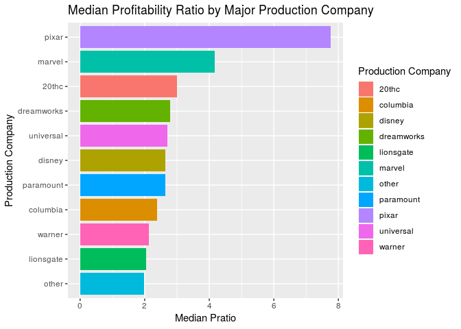

PROJECT TITLE
================
Zuck(R)berg
25 April 2019

Your project goes here\! Before you submit, make sure your chunks are
turned off with `echo = FALSE`.

You can add sections as you see fit. Make sure you have a section called
Introduction at the beginning and a section called Conclusion at the
end. The rest is up to you\!

### Introduction

### Stuff

For our dataset of 5000 movies, we decided to remove the variables id,
homepage, and original\_title, since we felt that these variables did
not contribute to our research question of what contributed to a
“successful” movie. Additionally, since we found problems with the
budget and revenue variables of non-American movies (not in US dollars),
we decided to filter for only english movies as a proxy for American
movies. (Since there is no definite way to filter for only American
movies). We also filtered for movies that had a budget and revenue that
were nonzero, this is so that our data would not be skewed by movies
that were not intended to draw revenue or were not of the same budget
caliber of the rest of the films.

<!-- -->

    ## # A tibble: 10 x 2
    ##    title                                                  popularity
    ##    <chr>                                                       <dbl>
    ##  1 Minions                                                      876.
    ##  2 Interstellar                                                 724.
    ##  3 Deadpool                                                     515.
    ##  4 Guardians of the Galaxy                                      481.
    ##  5 Mad Max: Fury Road                                           434.
    ##  6 Jurassic World                                               419.
    ##  7 Pirates of the Caribbean: The Curse of the Black Pearl       272.
    ##  8 Dawn of the Planet of the Apes                               244.
    ##  9 The Hunger Games: Mockingjay - Part 1                        206.
    ## 10 Big Hero 6                                                   204.

We are going to not look at popularity because we can’t figure out where
this came from,,, etc explain this.

    ## # A tibble: 10 x 2
    ##    title                                          budget
    ##    <chr>                                           <dbl>
    ##  1 Pirates of the Caribbean: On Stranger Tides 380000000
    ##  2 Pirates of the Caribbean: At World's End    300000000
    ##  3 Avengers: Age of Ultron                     280000000
    ##  4 Superman Returns                            270000000
    ##  5 John Carter                                 260000000
    ##  6 Tangled                                     260000000
    ##  7 Spider-Man 3                                258000000
    ##  8 The Lone Ranger                             255000000
    ##  9 The Dark Knight Rises                       250000000
    ## 10 Harry Potter and the Half-Blood Prince      250000000

    ## # A tibble: 2,516 x 1
    ##    production_companies                                                    
    ##    <chr>                                                                   
    ##  1 "[{\"name\": \"Ingenious Film Partners\", \"id\": 289}, {\"name\": \"Tw…
    ##  2 "[{\"name\": \"Walt Disney Pictures\", \"id\": 2}, {\"name\": \"Jerry B…
    ##  3 "[{\"name\": \"Columbia Pictures\", \"id\": 5}, {\"name\": \"Danjaq\", …
    ##  4 "[{\"name\": \"Legendary Pictures\", \"id\": 923}, {\"name\": \"Warner …
    ##  5 "[{\"name\": \"Walt Disney Pictures\", \"id\": 2}]"                     
    ##  6 "[{\"name\": \"Columbia Pictures\", \"id\": 5}, {\"name\": \"Laura Zisk…
    ##  7 "[{\"name\": \"Walt Disney Pictures\", \"id\": 2}, {\"name\": \"Walt Di…
    ##  8 "[{\"name\": \"Marvel Studios\", \"id\": 420}, {\"name\": \"Prime Focus…
    ##  9 "[{\"name\": \"Warner Bros.\", \"id\": 6194}, {\"name\": \"Heyday Films…
    ## 10 "[{\"name\": \"DC Comics\", \"id\": 429}, {\"name\": \"Atlas Entertainm…
    ## # … with 2,506 more rows

### Creating a “Profitability” Variables

The first profitability variable is a ratio of revenue to budget, to
show by what percentage a movie was “profitable.” This second
profitability variable is a categorical variable that deciphers if the
movie was profitable or not, based on the profitiability ratio. If the
ratio was greater than 1, it was considered profitable. It will simply
say “yes” for profitable, and “no” for non-profitable.

### Making a Categorical “spoken languages” Variable

Here, we will be creating a new vategorical variable, that signifies if
the only language spoken in the film is english, or not. If the only
spoken language is english, the value will be “yes,” if there are other
languages spoken or english is not used, the value will be “no.”

### Splitting date variable

### Genre trends

<!-- -->

<!-- -->

<!-- -->

<!-- -->

### Title and Profitability

<!-- -->

### Making a variable for holiday releases

### Making a variable for likely sequels

### Making a variable for major production companies

Major production companies according to Wikipedia are Universal Pictures
(NBCUniversal), Paramount Pictures (Viacom), WarnerBros. Pictures
(WarnerMedia), Walt Disney Pictures (Walt Disney Studios), Columbia
Pictures (Sony Pictures) (in the format Major film studio unit (Studio
parent) from
<https://en.wikipedia.org/wiki/Major_film_studio#Present_2>).

<!-- --><!-- -->

### Making a variable for tagline length

    ## # A tibble: 3,086 x 31
    ##    budget genres keywords original_langua… overview popularity
    ##     <dbl> <chr>  <chr>    <chr>            <chr>         <dbl>
    ##  1 2.37e8 "[{\"… "[{\"id… en               In the …      150. 
    ##  2 3.00e8 "[{\"… "[{\"id… en               Captain…      139. 
    ##  3 2.45e8 "[{\"… "[{\"id… en               A crypt…      107. 
    ##  4 2.50e8 "[{\"… "[{\"id… en               Followi…      112. 
    ##  5 2.60e8 "[{\"… "[{\"id… en               John Ca…       43.9
    ##  6 2.58e8 "[{\"… "[{\"id… en               The see…      116. 
    ##  7 2.60e8 "[{\"… "[{\"id… en               When th…       48.7
    ##  8 2.80e8 "[{\"… "[{\"id… en               When To…      134. 
    ##  9 2.50e8 "[{\"… "[{\"id… en               As Harr…       98.9
    ## 10 2.50e8 "[{\"… "[{\"id… en               Fearing…      156. 
    ## # … with 3,076 more rows, and 25 more variables:
    ## #   production_companies <chr>, production_countries <chr>, year <dbl>,
    ## #   month <dbl>, day <dbl>, revenue <dbl>, runtime <dbl>,
    ## #   spoken_languages <chr>, status <chr>, tagline <chr>, title <chr>,
    ## #   vote_average <dbl>, vote_count <dbl>, pratio <dbl>, profit <chr>,
    ## #   spokenlength <int>, english <chr>, horror <chr>, action <chr>,
    ## #   oneword <chr>, holiday_release <chr>, likely_sequel <chr>,
    ## #   if_major <chr>, major_productionco <chr>, tag_length <int>

### Making a preliminary linear model

We aim to find an ideal linear model to predict profitability ratio
based on a variety of factors; before constructing our model, we will
remove observations that lack values for these factors.

    ## # A tibble: 3,086 x 31
    ##    budget genres keywords original_langua… overview popularity
    ##     <dbl> <chr>  <chr>    <chr>            <chr>         <dbl>
    ##  1 2.37e8 "[{\"… "[{\"id… en               In the …      150. 
    ##  2 3.00e8 "[{\"… "[{\"id… en               Captain…      139. 
    ##  3 2.45e8 "[{\"… "[{\"id… en               A crypt…      107. 
    ##  4 2.50e8 "[{\"… "[{\"id… en               Followi…      112. 
    ##  5 2.60e8 "[{\"… "[{\"id… en               John Ca…       43.9
    ##  6 2.58e8 "[{\"… "[{\"id… en               The see…      116. 
    ##  7 2.60e8 "[{\"… "[{\"id… en               When th…       48.7
    ##  8 2.80e8 "[{\"… "[{\"id… en               When To…      134. 
    ##  9 2.50e8 "[{\"… "[{\"id… en               As Harr…       98.9
    ## 10 2.50e8 "[{\"… "[{\"id… en               Fearing…      156. 
    ## # … with 3,076 more rows, and 25 more variables:
    ## #   production_companies <chr>, production_countries <chr>, year <dbl>,
    ## #   month <dbl>, day <dbl>, revenue <dbl>, runtime <dbl>,
    ## #   spoken_languages <chr>, status <chr>, tagline <chr>, title <chr>,
    ## #   vote_average <dbl>, vote_count <dbl>, pratio <dbl>, profit <chr>,
    ## #   spokenlength <int>, english <chr>, horror <chr>, action <chr>,
    ## #   oneword <chr>, holiday_release <chr>, likely_sequel <chr>,
    ## #   if_major <chr>, major_productionco <chr>, tag_length <int>

We filter the dataset to remove movies with NA values so that our
backwards model selection will work (the only NAs in the values we are
considering are for tagline length)

    ## 
    ## Call:
    ## lm(formula = pratio ~ holiday_release + likely_sequel + budget + 
    ##     if_major + major_productionco + tag_length + english + runtime + 
    ##     action + horror + runtime + oneword + budget * if_major + 
    ##     likely_sequel * budget, data = movies_filt)
    ## 
    ## Coefficients:
    ##                  (Intercept)            holiday_releaseyes  
    ##                    2.723e+00                    -1.165e+00  
    ##             likely_sequelyes                        budget  
    ##                   -1.394e+00                    -6.471e-08  
    ##                  if_majoryes       major_productionco20thc  
    ##                   -4.453e-01                     1.928e+00  
    ##   major_productioncocolumbia      major_productioncodisney  
    ##                   -7.278e-01                     1.488e+00  
    ## major_productioncodreamworks   major_productioncolionsgate  
    ##                    4.734e-01                    -1.295e+00  
    ##     major_productioncomarvel   major_productioncoparamount  
    ##                    2.413e+00                     1.601e+00  
    ##      major_productioncopixar   major_productioncouniversal  
    ##                    5.564e+00                     1.298e+00  
    ##     major_productioncowarner                    tag_length  
    ##                           NA                    -3.029e-03  
    ##                   englishyes                       runtime  
    ##                    7.175e-01                     3.097e-02  
    ##                    actionyes                     horroryes  
    ##                   -7.427e-01                     1.904e+00  
    ##                   onewordyes            budget:if_majoryes  
    ##                    9.442e-01                     2.352e-08  
    ##      likely_sequelyes:budget  
    ##                    3.176e-08

    ## # A tibble: 22 x 2
    ##    term                              estimate
    ##    <chr>                                <dbl>
    ##  1 (Intercept)                   2.72        
    ##  2 holiday_releaseyes           -1.16        
    ##  3 likely_sequelyes             -1.39        
    ##  4 budget                       -0.0000000647
    ##  5 if_majoryes                  -0.445       
    ##  6 major_productionco20thc       1.93        
    ##  7 major_productioncocolumbia   -0.728       
    ##  8 major_productioncodisney      1.49        
    ##  9 major_productioncodreamworks  0.473       
    ## 10 major_productioncolionsgate  -1.30        
    ## # … with 12 more rows

We fit a regression model to predict pulse rate based on
holiday\_release, likely\_sequel, budget, if\_major,
major\_productionco, tag\_length, english, runtime, action, horror,
oneword, the interaction between budget and likely\_sequel, and the
interaction between budget and if\_major. We chose to examine the those
interactions because whether a movie is a sequel (and thus has a known
revenue for its precedents and some expectation that people will see it)
may be related to its budget and also the relation between budget and
having access to the resources we assume accompany a major production
company may also be related in an interesting way.

Linear Model:

Profitability Ratio = 2.7225325 + -1.1647646(Holiday Release) +
-1.3942962(Likely Sequel) + -6.471136410^{-8}(Budget) + -0.4453368(Major
Production Company) + 1.9283739(20th Century Fox) -0.7278017(Columbia) +
+ 1.4878933(Disney) + 0.4734365(DreamWorks) + -1.2954787(Lionsgate) +
2.4130099(Marvel) + 1.6005164(Paramount) + 5.5638577(Pixar) +
1.2983196(Universal) + -0.0030291(Tagline Length) + 0.717533(Spoken
Language English) + 0.0309721(Runtime) + -0.7426668(Action) +
1.904403(Horror) + 0.9442249(One Word Title) + 2.352159210^{-8}(Budget
\* Major Production Company) + 3.176081310^{-8}(Likely Sequel \* Budget)

    ## # A tibble: 1 x 11
    ##   r.squared adj.r.squared sigma statistic  p.value    df  logLik    AIC
    ##       <dbl>         <dbl> <dbl>     <dbl>    <dbl> <int>   <dbl>  <dbl>
    ## 1    0.0495        0.0425  9.80      7.07 1.41e-20    22 -10631. 21309.
    ## # … with 3 more variables: BIC <dbl>, deviance <dbl>, df.residual <int>

We compute the adjusted R-squared value for the filtered model for pulse
as 0.0424721; this is a helpful measure of the goodness of the fit of
the model.

    ## Start:  AIC=13148.02
    ## pratio ~ holiday_release + likely_sequel + budget + if_major + 
    ##     major_productionco + tag_length + english + runtime + action + 
    ##     horror + runtime + oneword + budget * if_major + likely_sequel * 
    ##     budget
    ## 
    ##                        Df Sum of Sq    RSS   AIC
    ## - major_productionco    9   1449.41 275681 13145
    ## - tag_length            1     14.26 274246 13146
    ## <none>                              274231 13148
    ## - action                1    278.46 274510 13149
    ## - english               1    300.90 274532 13149
    ## - oneword               1    408.86 274640 13150
    ## - holiday_release       1    465.92 274697 13151
    ## - budget:if_major       1    529.98 274761 13152
    ## - horror                1    917.76 275149 13156
    ## - runtime               1    999.96 275231 13156
    ## - likely_sequel:budget  1   1002.67 275234 13156
    ## 
    ## Step:  AIC=13145.17
    ## pratio ~ holiday_release + likely_sequel + budget + if_major + 
    ##     tag_length + english + runtime + action + horror + oneword + 
    ##     budget:if_major + likely_sequel:budget
    ## 
    ##                        Df Sum of Sq    RSS   AIC
    ## - tag_length            1     20.16 275701 13143
    ## <none>                              275681 13145
    ## - action                1    259.08 275940 13146
    ## - english               1    290.03 275971 13146
    ## - oneword               1    408.40 276089 13147
    ## - holiday_release       1    425.33 276106 13148
    ## - budget:if_major       1    572.98 276254 13149
    ## - horror                1    851.41 276532 13152
    ## - runtime               1    942.95 276624 13153
    ## - likely_sequel:budget  1   1082.60 276763 13154
    ## 
    ## Step:  AIC=13143.38
    ## pratio ~ holiday_release + likely_sequel + budget + if_major + 
    ##     english + runtime + action + horror + oneword + budget:if_major + 
    ##     likely_sequel:budget
    ## 
    ##                        Df Sum of Sq    RSS   AIC
    ## <none>                              275701 13143
    ## - action                1    254.31 275955 13144
    ## - english               1    299.20 276000 13144
    ## - oneword               1    419.78 276121 13146
    ## - holiday_release       1    422.79 276124 13146
    ## - budget:if_major       1    577.45 276278 13147
    ## - horror                1    872.52 276573 13150
    ## - runtime               1    925.15 276626 13151
    ## - likely_sequel:budget  1   1077.18 276778 13153

    ## # A tibble: 12 x 2
    ##    term                         estimate
    ##    <chr>                           <dbl>
    ##  1 (Intercept)              2.77        
    ##  2 holiday_releaseyes      -1.11        
    ##  3 likely_sequelyes        -1.26        
    ##  4 budget                  -0.0000000649
    ##  5 if_majoryes              0.244       
    ##  6 englishyes               0.713       
    ##  7 runtime                  0.0292      
    ##  8 actionyes               -0.700       
    ##  9 horroryes                1.84        
    ## 10 onewordyes               0.954       
    ## 11 budget:if_majoryes       0.0000000242
    ## 12 likely_sequelyes:budget  0.0000000324

We perform backwards model selection based on AIC, Akaike Information
Criterion (another measure of the fit of a model), and obtain the best
fit.

Selected Linear Model:

Profitability Ratio = 2.7657719 + -1.1068826(Holiday Release) +
-1.2582804(Likely Sequel) + -6.485295410^{-8}(Budget) + 0.2440909(Major
Production Company) + 0.7134955(Spoken Language English) +
0.0292268(Runtime) + -0.699804(Action) + 1.8439768(Horror) +
-1.2954787(One Word Title) + 2.4130099(Budget \* Major Production
Company) + 1.6005164(Likely Sequel \* Budget)

    ## [1] 21308.91

    ## [1] 21304.28

Our AIC value decreases for the selected model, which indicates that it
is a better fit. Thus factors of holiday\_release, likely\_sequel,
budget, ETC TYPE THE REST HERE are the best predictors of profitability.

    ## [1] 0.04437489

Our R-squared value of 0.0443749 for our final selected model indicates
that 4.4374892% of the variation in Profitability can be well-explained
by a linear relationship with INSERT LIST HERE

### Conclusion
