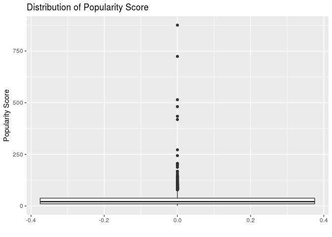
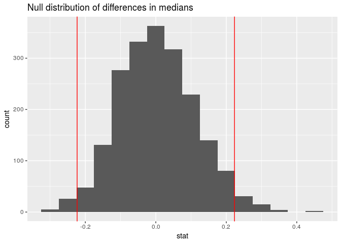

Hollywood Big-Bucks
================
Zuck(R)berg
25 April 2019

### Introduction

The movie industry is one that accounts for billions of dollars in
revenue and forms the keystone of the entertainment sector;
consequently, there are a wide variety of films that have had varying
degrees of success in the market. There are a variety of characteristics
and factors that make up a movie – budget, director, etc. – yet none of
these factors alone seem to have the power to drive a successful film.
Rather, a combination of positive factors must be achieved to dominate
the market. In this project, we will be attempting to address the
research question of what specific factors have the most effect in
predicting the profitability of a film.

### Stuff

In order to conduct our analysis, we will be using a dataset from Kaggle
known as the “TMBD 5000 Movie Dataset”. This dataset is a collection of
5000 movies and various characteristics, including budget, revenue, the
spoken language of the film, and various other traits.

There are a few variables we will remove from the dataset, as they
aren’t particularly useful for our analysis; among them are “id”,
“homepage”, and “original\_title”, as these variables are not related
to the films themselves but serve only to identify the movies within a
database.

Furthermore, we have filtered the original dataset for only movies whose
original\_language is listed as Engish. While this does cut out a
significant portion of the dataset, it was necessary due to a problem we
encountered with the budget and revenue variables – they weren’t all in
USD. While an English filter isn’t a perfect discriminator for American
currency values, it serves as a useful proxy and reduces the currency
discrepancy to a level that is statistically insignificant.

We have also filtered out movies that have values of zero for budget
and/or revenue. As our analysis focuses on how movies become successful,
we felt that movies with zero values were not seriously seeking
financial success, and consequently may skew our results since the films
were not designed to draw profits.

Here is a visualization of the distribution of the “popularity” variable
as well as its top 10 observations within the dataset.

<!-- -->

    ## # A tibble: 10 x 2
    ##    title                                                  popularity
    ##    <chr>                                                       <dbl>
    ##  1 Minions                                                      876.
    ##  2 Interstellar                                                 724.
    ##  3 Deadpool                                                     515.
    ##  4 Guardians of the Galaxy                                      481.
    ##  5 Mad Max: Fury Road                                           434.
    ##  6 Jurassic World                                               419.
    ##  7 Pirates of the Caribbean: The Curse of the Black Pearl       272.
    ##  8 Dawn of the Planet of the Apes                               244.
    ##  9 The Hunger Games: Mockingjay - Part 1                        206.
    ## 10 Big Hero 6                                                   204.

The “popularity” variable is another that we have decided to omit; as
you can see based on the above visualization and an ordered list of the
top 10 movies by “popularity”, there are a number of irregularities with
the variable. Firstly, popularity itself is not clearly defined by the
creators of the dataset, and consequently it is difficult to form any
useful statistical conclusion from its analysis. Furthermore, the
distribution of popular movies is odd, with a huge number of upper
outliers and significant right-skew. Finally, the intuitive definitions
of popularity – number of viewings, number of people that have seen the
film, or otherwise – are not apparent in the above top 10 list of
“popular” movies. While Minions and Interstellar are certainly
well-known films, they pale in comparison to more well-known movies that
actually don’t appear on this list at all. If one conducts a search for
“most popular movies”, the list that appears does not share a single
entry in common with the above 10 terms. Due to these strange findings,
popularity will also be omitted from our analysis.

At first, we hypothesized that budget would be the strongest indicator
of success; intuitively, companies that can afford to invest hundreds of
millions of dollars into a film are unlikely to lack the expertise to
profit from their creation. Out of a combination of this sentiment and
general curiosity, we compiled a list of the top 10 movies arranged by
budget.

    ## # A tibble: 10 x 2
    ##    title                                          budget
    ##    <chr>                                           <dbl>
    ##  1 Pirates of the Caribbean: On Stranger Tides 380000000
    ##  2 Pirates of the Caribbean: At World's End    300000000
    ##  3 Avengers: Age of Ultron                     280000000
    ##  4 Superman Returns                            270000000
    ##  5 John Carter                                 260000000
    ##  6 Tangled                                     260000000
    ##  7 Spider-Man 3                                258000000
    ##  8 The Lone Ranger                             255000000
    ##  9 The Dark Knight Rises                       250000000
    ## 10 Harry Potter and the Half-Blood Prince      250000000

    ## # A tibble: 2,516 x 1
    ##    production_companies                                                    
    ##    <chr>                                                                   
    ##  1 "[{\"name\": \"Ingenious Film Partners\", \"id\": 289}, {\"name\": \"Tw…
    ##  2 "[{\"name\": \"Walt Disney Pictures\", \"id\": 2}, {\"name\": \"Jerry B…
    ##  3 "[{\"name\": \"Columbia Pictures\", \"id\": 5}, {\"name\": \"Danjaq\", …
    ##  4 "[{\"name\": \"Legendary Pictures\", \"id\": 923}, {\"name\": \"Warner …
    ##  5 "[{\"name\": \"Walt Disney Pictures\", \"id\": 2}]"                     
    ##  6 "[{\"name\": \"Columbia Pictures\", \"id\": 5}, {\"name\": \"Laura Zisk…
    ##  7 "[{\"name\": \"Walt Disney Pictures\", \"id\": 2}, {\"name\": \"Walt Di…
    ##  8 "[{\"name\": \"Marvel Studios\", \"id\": 420}, {\"name\": \"Prime Focus…
    ##  9 "[{\"name\": \"Warner Bros.\", \"id\": 6194}, {\"name\": \"Heyday Films…
    ## 10 "[{\"name\": \"DC Comics\", \"id\": 429}, {\"name\": \"Atlas Entertainm…
    ## # … with 2,506 more rows

The results were actually quite surprising; around half of the films on
the list received significant negative press coverage and failed to meet
revenue expectations for movies of their caliber. At this point, we
became intrigued – what factors did these high budget movies lack that
might have improved their box office performance?

    ## # A tibble: 2,516 x 1
    ##    production_companies                                                    
    ##    <chr>                                                                   
    ##  1 "[{\"name\": \"Ingenious Film Partners\", \"id\": 289}, {\"name\": \"Tw…
    ##  2 "[{\"name\": \"Walt Disney Pictures\", \"id\": 2}, {\"name\": \"Jerry B…
    ##  3 "[{\"name\": \"Columbia Pictures\", \"id\": 5}, {\"name\": \"Danjaq\", …
    ##  4 "[{\"name\": \"Legendary Pictures\", \"id\": 923}, {\"name\": \"Warner …
    ##  5 "[{\"name\": \"Walt Disney Pictures\", \"id\": 2}]"                     
    ##  6 "[{\"name\": \"Columbia Pictures\", \"id\": 5}, {\"name\": \"Laura Zisk…
    ##  7 "[{\"name\": \"Walt Disney Pictures\", \"id\": 2}, {\"name\": \"Walt Di…
    ##  8 "[{\"name\": \"Marvel Studios\", \"id\": 420}, {\"name\": \"Prime Focus…
    ##  9 "[{\"name\": \"Warner Bros.\", \"id\": 6194}, {\"name\": \"Heyday Films…
    ## 10 "[{\"name\": \"DC Comics\", \"id\": 429}, {\"name\": \"Atlas Entertainm…
    ## # … with 2,506 more rows

We also took a cursory look at some of the production companies listed
in the dataset. Unsurprisingly, a large portion of the dataset’s movies
were created by name-brand companies, a fact that suggests that
financial resources must not have been the primary reason for the
failure of many movies.

### Creating a “Profitability” Variables

In order to investigate the financial success of movies, we defined two
variables which we will hereafter refer to as “profitability” variables.
The first of these, pratio, is a ratio of revenue to budget that
expresses the percentage by which a movie earns more or less than its
budget. For example, a movie that has a revenue twice its budget will
have a pratio of 2. This variable is numerical and continuous; to aid in
our analysis, we’ve created a second, categorical variable called
“profitable” that divides movies into two categories – profitable or
not. If the pratio is greater than 1, the movie is profitable and
displays an entry of “yes”. If not, then the observation is listed as
“no”.

Initially, the pratio variable displayed summary statistics that were
entirely unreasonable – a mean pratio of over one hundred, for example –
and we discovered the cause quickly; some movies listed their budgets in
units of one million dollars while their revenues were recorded in
simple USD. Consequently, their pratios were in the hundreds of
thousands. In order to fix this, we did additional research and found
that the highest true pratio in a movie belongs to “Paranormal Activity”
with a value of around 200. Consequently, all values above 200 are
data-entry errors and were filtered out. Fortunately, there are no
erroneous entries below 200, as budget entry errors relating to the
millions unit have a minimum effect on pratio of 6 orders of magnitude.

In analyzing pratio, we will begin with a 95% confidence interval of the
median pratios for films to get a general sense of where the median
value might lie.

    ## # A tibble: 1 x 2
    ##   lower uppper
    ##   <dbl>  <dbl>
    ## 1  2.20   2.39

The above values, 2.20 and 2.39, allow me to state with 95% confidence
that the true median pratio for movies lies between 2.20 and 2.39. This
conclusion is surprising; one would intuitively expect a majority, or at
least sizeable minority, of movies to achieve break-even status or less.
Rather, the confidence interval establishes that, with 95% certainty,
around half of movies – those greater than the median – have pratios in
excess of 2.20 while¬¬¬ far less than half of movies fail to be
profitable. Making a successful movie may be easier than we thought\!

After the above glance at profitability in general, we’ve will now
create a few more variables with which to analyze profitability and
examine some different trends.

### Categorical Spoken English Variable

Recall that we originally filtered the data for movies whose
“original\_language” was English; there are a multitude of movies who
still features spoken languages other than English. Consequently, we
will be mutating a new variable, “english” which splits movies into two
groups – those that are entirely spoken in English and those that
features other languages. We will use this variable later in our
analysis, but we hypothesize that English-only movies will earn higher
revenues.

### Splitting date variable

We will now wrangle the dates in the dataset for use in the next
segment, a process which requires us to convery the dates in the data to
a better form. The dates in the dataset originally came in character
form as “yr-mo-day” form, but character format isn’t particularly useful
for analyzing dates – rather, a numeric form is preferred. We split the
character format into 3 parts and converted the values to 3 numeric
variables as day, month, and year.

### Genre Trends

Now that we have a proper format for our dates, we can analyze another
characteristic’s effect on profitability over time – genres. In order to
create a genre variable, we used a string detect function that scans for
“Horror” under a movie’s genres. We have decided to work with the
“horror” genre specifically as we noticed that they generally have
lower budgets than other types of films. See below a table that reflects
the stark difference – non-horror movies seem to cost nearly twice as
much.

    ## # A tibble: 2 x 2
    ##   horror `median(budget)`
    ##   <chr>             <dbl>
    ## 1 no             30000000
    ## 2 yes            14500000

As a result, it’s easier for a horror movie to achieve a high pratio, a
fact which is reflected in the movie with the highest pratio –
Paranormal Activity with a value of nearly 200\! We formulated the
following question in regard to horror movies.

Does this data provide convincing evidence of a difference in median
pratios for horror vs non-horror movies?

Null Hypothesis: A movie’s status as a horror film is independent of its
pratio.

Alternative Hypothesis: A movie’s status as a horror film is a
dependency for its pratio.

The below value is the sample median difference in pratios between
horror and non-horror movies – at .5147, our sample’s horror movies had
a 50% higher return on their budgets than in non-horror movies. In order
to generalize, however, we must run a hypothesis test. Below is our
generated null distribution for a difference in medians (horror –
non-horror) with 1000 repetitions, as well as upper and lower bounds of
+/- .5147. By running a hypothesis test for independence with an alpha
value of .05, we found a p-value of .004, a value which gives convincing
evidence to reject the null hypothesis and conclude that horror movies
have higher pratios.

    ## [1] 0.5147204

<!-- -->

    ## # A tibble: 1 x 1
    ##   pvalue
    ##    <dbl>
    ## 1  0.004

    ## # A tibble: 1 x 2
    ##    lower upper
    ##    <dbl> <dbl>
    ## 1 -0.274 0.381

By running a hypothesis test for independence with an alpha value of
.05, we found a p-value of .004, a value which gives convincing evidence
to reject the null hypothesis and conclude that horror movies have
higher pratios.

We also ran a 95% confidence interval for the true median difference in
pratio. The displayed interval, (-.274, .381). allows us to state with
95% confidence that the true median difference in pratios between horror
and non-horror movies, subtracting the latter from the former, is
between -.274 and .381.

Using our newly-created date values, we also wanted to track
profitability of horror movies over time as well as the sheer number of
horror movies created. Below are two visualizations: first, an
examination of the profitability over time and secondly a glance at the
number of horror movies created in each year.

<!-- -->

<!-- -->

The relationship between these two graphs is interesting, as they seem
to mirror each other to a certain extent. Observe two main similarities.
Firstly, they are both bimodal with modes appearing around the 1990s and
2010s, although the second graph’s first “mode” is dwarfed by the 2010s
mode in a way that doesn’t apply to the first graph. Secondly, they both
experience low values at the same time; these two observations can be
well-explained by an economic theory. Simply put, the more profitable
that producing a movie is, the more movies that will be created.

The next genre that we’ll examine is action, a genre that we chose for
its antithetical nature to horror. Action budgets seem to be
extraordinarily large in comparison to other genres, as shown by the
below chart.

    ## # A tibble: 2 x 2
    ##   action `median(budget)`
    ##   <chr>             <dbl>
    ## 1 no             21000000
    ## 2 yes            50000000

Action movies have a median budget of more than twice that of other
movies’ median budget. We’ve also gone ahead and calculated a sample
difference of pratios between action and non-action movies (in that
order) for our sample – a value of -.223. In a very similar procedure to
the horror movies, we’ve created a null distribution of 2000 values of
the differences in median pratio between action movies and non-action
movies.

    ## [1] -0.2232571

<!-- -->

    ## # A tibble: 1 x 1
    ##   pvalue
    ##    <dbl>
    ## 1  0.108

    ## # A tibble: 1 x 2
    ##    lower upper
    ##    <dbl> <dbl>
    ## 1 -0.202 0.225

From our hypothesis test, we found a p-value of .108 – above our alpha
level of .05. Thus, we do not have convincing evidence to reject a null
hypothesis of no difference in pratios. We’ve also computed a 95%
confidence interval for the true median difference between action and
non-action movies in that order, arriving at values of –.202 and .225.
Consequently, we can state with 95% confidence that the true typical
difference in median pratios for action and non-action movies lies
between -.202 and .225.

In a similar process, we examined the profitability and frequency of
action movies over time.

<!-- -->

<!-- -->

Again, the plots look very similar, but rather than sharing key points
as the horror movies did, the action genre’s plots share a steady upward
trend beginning in the 1990s. Again, profitability may be driving more
movies to be created out of economic incentivization.

### Title and Profitability

The next factor we’ll be examining is the title of a movie with specific
attention to the length of the title. Intuition isn’t much use here;
longer titles and shorter titles seem equally likely to garner revenue.
In order to get a general idea of how title length might affect the
pratio, we will examine the medians for long and short movie titles.

<!-- -->

Interestingly, there does appear to be a greater pratio for films with a
title of three words or less\! Below, we’ve calculated the exact
difference in our sample to be a difference in medians of approximately
.36. In order to generalize our results, however, we must conduct a
hypothesis test.

    ## [1] 0.3637289

We will conduct a hypothesis test for independence with the following
null hypothesis.

Null Hypothesis: Pratio is independent of title length.

Alternative Hypothesis: Pratio is dependent on title length.

Using the sample median above, we will create a null distribution of the
difference in medians (“yes” - “no”) with 1000 repetitions and a
permutation simulation
    type.

    ## `stat_bin()` using `bins = 30`. Pick better value with `binwidth`.

<!-- -->

    ## # A tibble: 1 x 1
    ##   pvalue
    ##    <dbl>
    ## 1  0.008

By using our sample median difference and applying its bounds to the
null distribution, we arrive at a p-value of .008, which is below the
alpha level and offers convincing evidence for us to reject the null
hypothesis and conclude that pratio is dependent on title length.

After analyzing title length, we’re going to create a few more variables
in preparation for our linear model. Specifically, we will create below
the variables for holiday release, sequels, major production company
status, and tagline length.

### Holiday Releases

Holiday releases – releasing on Halloween, Christmas, and other major
festivities – might gather more revenues, due to the greater amount of
disposable income being spent on these days. In order to create a
categorical variable for holiday release, we filtered for movies
released on dates on or directly around specific holidays and holiday
periods. This variable is categorical and returns an answer of “yes” for
holidays and “no” for non-holidays.

We will use this variable later in a final linear model.

### Making a variable for likely sequels

We’ve also created a variable for likely sequels; the “likely” refers to
the fact that our system for generating this variable relies on the most
obvious indicators and will likely have both false negatives and false
positives. However, the system is reliable enough for our purposes in
this investigation. Essentially, we mutated likely\_sequel to return a
“yes” response if a string detect detects a number in the movie’s
title or a colon, both of which commonly appear in sequels. We suspect
that a movie’s status as a sequel will decrease its revenue, since many
believe that sequels tend to be worse than their predecessors. On the
other hand, sequels draw additional revenue since fans of a prior movie
will commit to seeing the new version.

### Making a variable for major production companies

The next variable that we’ve created is “if\_major”, which expresses
whether a given movie is a created by a major production company. We’ve
determined which studios are “major” based on some outside research; the
list of major producers includes Universal Pictures, Paramount Pictures,
WarnerBros. Pictures, Walt Disney Pictures, Columbia Pictures,
Lionsgate, Dreamworks, Twentieth Century Fox, Pixar, and Marvel. In
order to create this variable, we used a sequence of str\_detect
functions and converted their results with a case\_when function.

Below is a visualization of the median pratio for each of the listed
studios.

<!-- -->

Interestingly, the medians tend to be lower than we predicted; assuming
that greater budget leads to greater revenue, these major producers
should be achieving maximum profitability, which they clearly do not
with the exception of Pixar, who outperforms the other companies by two
to three times as much profitability. In order to be certain about major
companies as a whole, however, we ran a hypothesis test below.

First, we computed our sample difference on which to base the test – we
found a median difference of .633 between major and non-major production
companies in our sample.

    ## [1] 0.6328664

Now, we will establish a null and alternative hypothesis.

Null: There is no difference in pratio based on a relationship with
major and non-major production companies.

Alternative: There is a difference in pratio based on a relationship
with major and non-major production companies.

<!-- -->

    ## # A tibble: 1 x 1
    ##   pvalue
    ##    <dbl>
    ## 1      0

    ## # A tibble: 1 x 2
    ##    lower upper
    ##    <dbl> <dbl>
    ## 1 -0.183 0.198

Generating a null distribution of 1000 values and applying our sample
statistic bounds, we find a p-value of zero, suggesting that there is
convincing evidence that there is a difference in pratio between major
and non-major production companies. Furthermore, based on the above
values for a 95% confidence interval, we can state with 95% confidence
that the true difference in median pratio between major and non-major
produced movies is between -.183 and .198.

### Making a variable for tagline length

The next variable we’ve created is tagline length – this is a simple
measurement of the character length of the movie’s tagline or
“promotional statement” generally attached to the movie’s promotional
materials.

    ## # A tibble: 10 x 1
    ##    tagline                                       
    ##    <chr>                                         
    ##  1 Enter the World of Pandora.                   
    ##  2 At the end of the world, the adventure begins.
    ##  3 A Plan No One Escapes                         
    ##  4 The Legend Ends                               
    ##  5 Lost in our world, found in another.          
    ##  6 The battle within.                            
    ##  7 They're taking adventure to new lengths.      
    ##  8 A New Age Has Come.                           
    ##  9 Dark Secrets Revealed                         
    ## 10 Justice or revenge

Here are a few examples of movie taglines. We have applied a str\_length
function to each tagline to form our tagline length variable
“tag\_length”.

### Making a preliminary linear model

We aim to find an ideal linear model to predict profitability ratio
based on a variety of factors; before constructing our model, we will
remove observations that lack values for these factors.

Now that we’ve created all of our variables, we can begin to create a
linear model to try and predict profitability. First, we have removed
all NA values for the variables under consideration, although this step
is not shown. The only NA values in the dataset were present exclusively
in the new tagline variable, however.

Below, we’ve fitted an initial linear model which takes into account all
of the variables previously mentioned as well as a few interactions:
budget and if\_major, due to the clear relationship between being a
major company and having access to a large budget, and budget \*
likely\_sequel, due to the funding relationship that a movie might have
with a successful predecessor.

    ## 
    ## Call:
    ## lm(formula = pratio ~ holiday_release + likely_sequel + budget + 
    ##     if_major + major_productionco + tag_length + english + runtime + 
    ##     action + horror + runtime + few_words + budget * if_major + 
    ##     likely_sequel * budget, data = movies_filt)
    ## 
    ## Coefficients:
    ##                  (Intercept)            holiday_releaseyes  
    ##                    2.920e+00                    -1.142e+00  
    ##             likely_sequelyes                        budget  
    ##                   -1.653e+00                    -6.483e-08  
    ##                  if_majoryes       major_productionco20thc  
    ##                   -5.043e-01                     1.943e+00  
    ##   major_productioncocolumbia      major_productioncodisney  
    ##                   -6.863e-01                     1.536e+00  
    ## major_productioncodreamworks   major_productioncolionsgate  
    ##                    4.269e-01                    -1.159e+00  
    ##     major_productioncomarvel   major_productioncoparamount  
    ##                    2.482e+00                     1.653e+00  
    ##      major_productioncopixar   major_productioncouniversal  
    ##                    5.552e+00                     1.349e+00  
    ##     major_productioncowarner                    tag_length  
    ##                           NA                    -3.972e-03  
    ##                   englishyes                       runtime  
    ##                    6.922e-01                     3.145e-02  
    ##                    actionyes                     horroryes  
    ##                   -6.916e-01                     1.946e+00  
    ##                 few_wordsyes            budget:if_majoryes  
    ##                    9.441e-02                     2.390e-08  
    ##      likely_sequelyes:budget  
    ##                    3.145e-08

    ## # A tibble: 22 x 2
    ##    term                              estimate
    ##    <chr>                                <dbl>
    ##  1 (Intercept)                   2.92        
    ##  2 holiday_releaseyes           -1.14        
    ##  3 likely_sequelyes             -1.65        
    ##  4 budget                       -0.0000000648
    ##  5 if_majoryes                  -0.504       
    ##  6 major_productionco20thc       1.94        
    ##  7 major_productioncocolumbia   -0.686       
    ##  8 major_productioncodisney      1.54        
    ##  9 major_productioncodreamworks  0.427       
    ## 10 major_productioncolionsgate  -1.16        
    ## # … with 12 more rows

Linear Model:

Profitability Ratio = 2.9202948 + -1.1415792(Holiday Release) +
-1.6533754(Likely Sequel) + -6.483095110^{-8}(Budget) + -0.5043299(Major
Production Company) + 1.9426156(20th Century Fox) -0.6862866(Columbia) +
+ 1.536474(Disney) + 0.4268544(DreamWorks) + -1.1593277(Lionsgate) +
2.4821382(Marvel) + 1.6528298(Paramount) + 5.5518353(Pixar) +
1.348584(Universal) + -0.0039722(Tagline Length) + 0.6921555(Spoken
Language English) + 0.0314541(Runtime) + -0.6916269(Action) +
1.9458229(Horror) + 0.0944092(One Word Title) + 2.389925810^{-8}(Budget
\* Major Production Company) + 3.145362310^{-8}(Likely Sequel \* Budget)

    ## # A tibble: 1 x 11
    ##   r.squared adj.r.squared sigma statistic  p.value    df  logLik    AIC
    ##       <dbl>         <dbl> <dbl>     <dbl>    <dbl> <int>   <dbl>  <dbl>
    ## 1    0.0481        0.0411  9.81      6.86 8.86e-20    22 -10634. 21313.
    ## # … with 3 more variables: BIC <dbl>, deviance <dbl>, df.residual <int>

We compute the adjusted R-squared value for the model as 0.0410583; this
is a helpful measure of the goodness of the fit of the model.

Below, we have performed backwards selection on our preliminary model
and arrive at an optimal model.

    ## Start:  AIC=13152.26
    ## pratio ~ holiday_release + likely_sequel + budget + if_major + 
    ##     major_productionco + tag_length + english + runtime + action + 
    ##     horror + runtime + few_words + budget * if_major + likely_sequel * 
    ##     budget
    ## 
    ##                        Df Sum of Sq    RSS   AIC
    ## - major_productionco    9   1449.22 276085 13149
    ## - few_words             1      3.96 274640 13150
    ## - tag_length            1     24.52 274661 13150
    ## <none>                              274636 13152
    ## - action                1    242.00 274878 13153
    ## - english               1    280.22 274916 13153
    ## - holiday_release       1    447.76 275084 13155
    ## - budget:if_major       1    547.32 275184 13156
    ## - horror                1    958.28 275595 13160
    ## - likely_sequel:budget  1    983.00 275619 13160
    ## - runtime               1   1031.77 275668 13161
    ## 
    ## Step:  AIC=13149.39
    ## pratio ~ holiday_release + likely_sequel + budget + if_major + 
    ##     tag_length + english + runtime + action + horror + few_words + 
    ##     budget:if_major + likely_sequel:budget
    ## 
    ##                        Df Sum of Sq    RSS   AIC
    ## - few_words             1      3.69 276089 13147
    ## - tag_length            1     32.57 276118 13148
    ## <none>                              276085 13149
    ## - action                1    222.82 276308 13150
    ## - english               1    270.36 276356 13150
    ## - holiday_release       1    408.12 276494 13152
    ## - budget:if_major       1    587.75 276673 13154
    ## - horror                1    893.65 276979 13157
    ## - runtime               1    973.58 277059 13158
    ## - likely_sequel:budget  1   1065.49 277151 13158
    ## 
    ## Step:  AIC=13147.43
    ## pratio ~ holiday_release + likely_sequel + budget + if_major + 
    ##     tag_length + english + runtime + action + horror + budget:if_major + 
    ##     likely_sequel:budget
    ## 
    ##                        Df Sum of Sq    RSS   AIC
    ## - tag_length            1     31.54 276121 13146
    ## <none>                              276089 13147
    ## - action                1    224.51 276314 13148
    ## - english               1    270.75 276360 13148
    ## - holiday_release       1    408.22 276497 13150
    ## - budget:if_major       1    587.99 276677 13152
    ## - horror                1    891.10 276980 13155
    ## - runtime               1    975.48 277065 13156
    ## - likely_sequel:budget  1   1069.48 277159 13156
    ## 
    ## Step:  AIC=13145.76
    ## pratio ~ holiday_release + likely_sequel + budget + if_major + 
    ##     english + runtime + action + horror + budget:if_major + likely_sequel:budget
    ## 
    ##                        Df Sum of Sq    RSS   AIC
    ## <none>                              276121 13146
    ## - action                1    218.39 276339 13146
    ## - english               1    281.30 276402 13147
    ## - holiday_release       1    404.84 276526 13148
    ## - budget:if_major       1    593.86 276715 13150
    ## - horror                1    918.17 277039 13153
    ## - runtime               1    950.99 277072 13154
    ## - likely_sequel:budget  1   1062.44 277183 13155

    ## # A tibble: 11 x 2
    ##    term                         estimate
    ##    <chr>                           <dbl>
    ##  1 (Intercept)              2.95        
    ##  2 holiday_releaseyes      -1.08        
    ##  3 likely_sequelyes        -1.47        
    ##  4 budget                  -0.0000000649
    ##  5 if_majoryes              0.217       
    ##  6 englishyes               0.692       
    ##  7 runtime                  0.0296      
    ##  8 actionyes               -0.647       
    ##  9 horroryes                1.89        
    ## 10 budget:if_majoryes       0.0000000246
    ## 11 likely_sequelyes:budget  0.0000000321

We performed backwards selection based on AIC. Consequently, our
selected model has a lower AIC value than the preliminary model - a fact
which shows that the selected model is a better fit.

Selected Linear Model:

Profitability Ratio = 2.9470363 + -1.0828735(Holiday Release) +
-1.4716737(Likely Sequel) + -6.491333510^{-8}(Budget) + 0.2173254(Major
Production Company) + 0.691595(Spoken Language English) +
0.029626(Runtime) + -0.647395(Action) + 1.8903615(Horror) +
-1.1593277(One Word Title) + 2.4821382(Budget \* Major Production
Company) + 1.6528298(Likely Sequel \* Budget)

Below is a comparison of the preliminary model’s AIC compared to the
selected model’s AIC. Note that the lower value accompanies the selected
model.

    ## [1] 21313.16

    ## [1] 21306.65

    ## [1] 0.04291985

Our R-squared value of 0.0429198 for our final selected model indicates
that 4.2919848% of the variation in profitability ratio can be
well-explained by a linear relationship with the selected variables.

### A quick look at budget vs revenue

As a final visualization and analysis, we looked at the relationship
between budget and revenue. We created a single variable linear
regression with budget as the explanatory variable, which led to an
equation based on the values below

    ## # A tibble: 2 x 2
    ##   term         estimate
    ##   <chr>           <dbl>
    ## 1 (Intercept) 143491.  
    ## 2 budget           2.98

Regression: Revenue = 143491 + 2.98(budget)

The above equation nets an R-Squared value of 0.497329, implying that
approximately 49.73% of the linear variation in revenue can be
well-explained by a linear relationship with budget.

<!-- -->

In this final visualization, we have colored data points by whether they
were created by a major company or not and colored it accordingly. Note
that the slope of the major companies’ regression line is steeper, and
the data points tend to be placed further to the right and up due to the
greater resources of larger companies. All of the highest budgeted
movies were created by major companies.

### Conclusion

Our final R-Squared value of only around .04 is dissapointing predictive
power on the part of our final model, but there are a few issues with
our analysis that we believe may be lowering this value. Firstly, the
dataset has a few key issues.

There are data entry errors and inconsistencies. Specifically, as we
have discussed prior, certain budgets are underestimated by six orders
of magnitude. These irregular data points can wreak havoc on any sort of
linear relationship between budget and other variables. While we’ve
removed the most egregious offenders, there may still be examples of
budgets underestimated by 3 or less orders of magnitude that can lower
our R-Squared value.

The other broad category of data error is the currency issue noted
previously. Again, while filtering for English as the original language
is helpful in this regard, some of the entries still possess non-USD
entries for budget and revenue. Since the data does not include units,
there is no absolutely effective method of discriminating for the type
of currency used other than manually checking all 5000 movies.

Inflation may also play a part in our strange findings; some values have
been adjusted for inflation while others have not. Furthermore, the
inflation adjustments might be made using different “base years” for
certain observations. Consequently, the linear relationship can be
comfounded and muddled by the effects of inflation on the data.

Even with a fairly low R-Squared value, we can still draw some
interesting conclusions about the data and apply our findings to the
real world. Firstly, budget is not an exclusive gatekeeper to a
successful film; any combination of enough of the other preferential
traits we have analyzed can create success, even in spite of a low
budget. We see this truth as well as its contrafactual with a simple
glance at two films: Pirates of the Caribbean: On Stranger Tides and
Paranormal Activity. The former failed under the influence of the
highest budget while the latter is the most profitable movie of all time
by percentage with a budget less than $100,000.

With specific reference to our investigation question of what factors
make a movie profitable, we have seen firsthand the difficulty of
predicting the success of a movie; this isn’t surprising when one
considers that there are still movies being made today that consider all
of the above variables, but still fail. The variables we have selected
play a small, but important role in a movie’s success. Even with an
R-Squared value of only .04 and consequent well-explained linear
relationship, a 4% difference in pratio can account for millions or tens
of millions of dollars. The most valuable information that we have found
may not come in the form of what companies need to focus on, but rather
the factors on which they should avoid wasting resources - taglines, for
example. As we’ve seen with the horror genre, every reduction of cost -
cutting out unncecessary factors - increases the potential for very high
profitability ratios.
