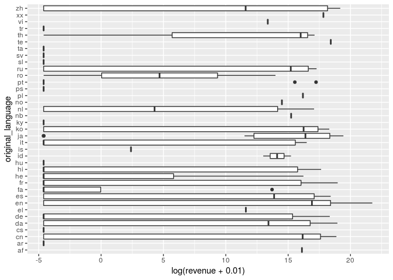

How Does Hollywood Bring In the Big Bucks?
================
zuck(R)berg
03/29/19

## Section 1. Introduction

The dataset we are using is “TMBD 5000 Movie Dataset.”

Originally, we found this set on kaggle.com. The data originates from
“The Movie Database” API, it was collected from this original dataset.

The data’s variables: budget genres homepage id keywords
original\_language original\_title overview popularity
production\_companies production\_countries release\_date revenue
runtime spoken\_languages status tagline title vote\_average Vote\_count

Our research question would be, what variables correlate to a high
revenue rate?

## Section 2. Data analysis plan

The outcome would be revenue, and predictors would include but not be
limited to the following variables: budget, production\_companies,
keywords, spoken\_languages, original\_language, release\_date, and
revenue,
    popularity.

``` r
library(tidyverse)
```

    ## ── Attaching packages ────────────────────────────────────────── tidyverse 1.2.1 ──

    ## ✔ ggplot2 3.1.0       ✔ purrr   0.3.2  
    ## ✔ tibble  2.1.1       ✔ dplyr   0.8.0.1
    ## ✔ tidyr   0.8.3       ✔ stringr 1.4.0  
    ## ✔ readr   1.3.1       ✔ forcats 0.4.0

    ## ── Conflicts ───────────────────────────────────────────── tidyverse_conflicts() ──
    ## ✖ dplyr::filter() masks stats::filter()
    ## ✖ dplyr::lag()    masks stats::lag()

``` r
movies <- read_csv("tmdb_5000_movies.csv")
movies <- movies %>%
  select(-id, -homepage, -original_title, -popularity)
```

``` r
movies %>%
  summarise(meanrev = mean(revenue)) 
```

    ## # A tibble: 1 x 1
    ##     meanrev
    ##       <dbl>
    ## 1 82260639.

``` r
movies %>%
  select(status) %>%
  distinct()
```

    ## # A tibble: 3 x 1
    ##   status         
    ##   <chr>          
    ## 1 Released       
    ## 2 Post Production
    ## 3 Rumored

``` r
movies %>%
  ggplot(aes(vote_average)) +
  geom_histogram()
```

    ## `stat_bin()` using `bins = 30`. Pick better value with `binwidth`.

<!-- -->

This is the average revenue for all the movies in the dataset. We would
consider a movie to have a high revenue if they are greater than the
average.

``` r
movies %>%
  ggplot(mapping= aes(original_language, log(revenue))) +
  geom_boxplot() +
  coord_flip()
```

    ## Warning: Removed 1427 rows containing non-finite values (stat_boxplot).

<!-- -->

## Section 3. Data

``` r
glimpse(movies)
```

    ## Observations: 4,803
    ## Variables: 16
    ## $ budget               <dbl> 2.37e+08, 3.00e+08, 2.45e+08, 2.50e+08, 2.6…
    ## $ genres               <chr> "[{\"id\": 28, \"name\": \"Action\"}, {\"id…
    ## $ keywords             <chr> "[{\"id\": 1463, \"name\": \"culture clash\…
    ## $ original_language    <chr> "en", "en", "en", "en", "en", "en", "en", "…
    ## $ overview             <chr> "In the 22nd century, a paraplegic Marine i…
    ## $ production_companies <chr> "[{\"name\": \"Ingenious Film Partners\", \…
    ## $ production_countries <chr> "[{\"iso_3166_1\": \"US\", \"name\": \"Unit…
    ## $ release_date         <date> 2009-12-10, 2007-05-19, 2015-10-26, 2012-0…
    ## $ revenue              <dbl> 2787965087, 961000000, 880674609, 108493909…
    ## $ runtime              <dbl> 162, 169, 148, 165, 132, 139, 100, 141, 153…
    ## $ spoken_languages     <chr> "[{\"iso_639_1\": \"en\", \"name\": \"Engli…
    ## $ status               <chr> "Released", "Released", "Released", "Releas…
    ## $ tagline              <chr> "Enter the World of Pandora.", "At the end …
    ## $ title                <chr> "Avatar", "Pirates of the Caribbean: At Wor…
    ## $ vote_average         <dbl> 7.2, 6.9, 6.3, 7.6, 6.1, 5.9, 7.4, 7.3, 7.4…
    ## $ vote_count           <dbl> 11800, 4500, 4466, 9106, 2124, 3576, 3330, …
