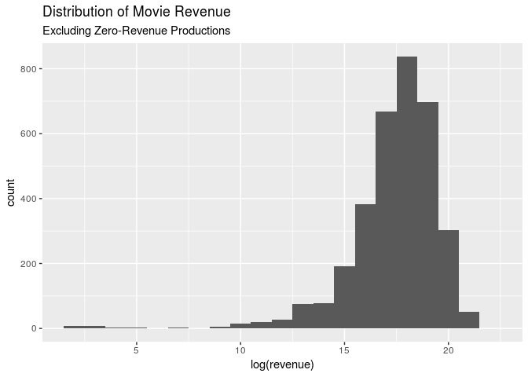
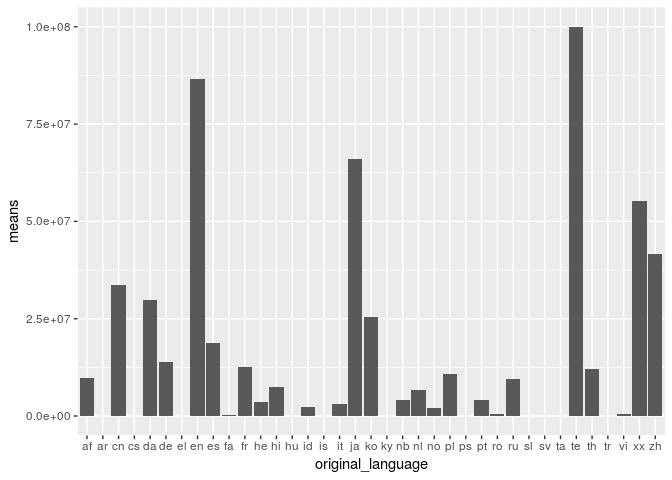

How Does Hollywood Bring In the Big Bucks?
================
zuck(R)berg
03/29/19

## Section 1. Introduction

The dataset we are using is “TMBD 5000 Movie Dataset.”

Originally, we found this set on kaggle.com. The data originates from
“The Movie Database” API, it was collected from this original dataset.
Each case, or observation, represents a film.

The data’s variables: budget genres homepage id keywords
original\_language original\_title overview popularity
production\_companies production\_countries release\_date revenue
runtime spoken\_languages status tagline title vote\_average Vote\_count

We aim to investigate which features of a movie correspond to higher
profits. Which variables from the dataset correlate to a high revenue
rate?

## Section 2. Data Analysis Plan

Our outcome variable is revenue, and predictors would include but not be
limited to the following variables: budget, production\_companies,
keywords, spoken\_languages, original\_language, release\_date, and
vote\_average. Possible comparison groups include

``` r
library(tidyverse)

movies <- read_csv("tmdb_5000_movies.csv")
movies <- movies %>%
  select(-id, -homepage, -original_title, -popularity)
```

We remove the variables id, homepage, original\_title, and popularity to
form an updated 16 column dataset- we will not use these in our
analysis. We also filter the data so we will only be considering
released movies, not rumored movies or those post production.

``` r
movies %>%
  summarise(meanrev = mean(revenue))
```

    ## # A tibble: 1 x 1
    ##     meanrev
    ##       <dbl>
    ## 1 82260639.

``` r
#Plot log(revenue + .01) because log(0) is undefined and 1 cent makes a negligible difference
ggplot(data = movies, aes(log(revenue + .01))) +
  geom_histogram(binwidth = 1) +
  labs(title = "Distribution of Movie Revenue")
```

<!-- -->

Mean revenue within the dataset is $82,260,639 and the data is
left-skewed. A significant number of movies brought in $0 in revenue,
and when we remove these films the mean revenue changes.

``` r
rev_movies <- movies %>%
  filter(revenue != 0)

rev_movies %>%
  summarise(meanrev = mean(revenue))
```

    ## # A tibble: 1 x 1
    ##      meanrev
    ##        <dbl>
    ## 1 117031353.

``` r
#Plot log(revenue)
ggplot(data = rev_movies, aes(log(revenue))) +
  geom_histogram(binwidth = 1) +
  labs(title = "Distribution of Movie Revenue", subtitle = "Excluding Zero-Revenue Productions")
```

<!-- -->

The mean revenue for all films with net profit is $117,031,353. We will
consider any film with a greater revenue than this mean to have a “high”
revenue.

``` r
ggplot(data = movies, aes(vote_average)) +
  geom_histogram() +
  labs(title = "Distribution of Vote Average")
```

    ## `stat_bin()` using `bins = 30`. Pick better value with `binwidth`.

<!-- -->

``` r
movies <- movies %>%
  mutate(high_rev = case_when(
    revenue > 117031353 ~ "yes",
    revenue <= 117031353 ~ "no"
  ))

ggplot(data = movies, aes(x = vote_average, y = revenue, color = high_rev)) +
  geom_point(alpha = 0.3) +
  labs(title = "Vote Average vs. Revenue")
```

<!-- -->

We examine the distribution of average ratings given to the movies in
the set and look at the relationship between vote\_average and revenue
to determine if there is a correlation between people thinking a movie
is good and having a high revenue. There seems to be an interesting
selection of outlier films with extremely high ratings and no revenue.
Perhaps we can investigate the variable vote\_count to determine if a
low vote count for a lesser-known film could skew this vote and lead to
outliers.

Statistical methods that will likely be useful in answering our question
include backwards model selection (to determine with which variables
together form the best linear model for revenue), as well as hypothesis
testing (conducting a null hypothesis test for independence between
revenue and other variables which we suspect correlate).

We could conduct a null hypothesis test for independence between revenue
and budget (although likely we will establish other categorical filters
first, like examining the relationship per production company or within
each genre). We would need a p-value less than .05 to reject the null
hypothesis test and confirm that budget does in fact correlate to
revenue.

``` r
ggplot(data = movies, aes(x = budget, y = revenue, color = high_rev)) +
  geom_point(alpha = .5) +
  labs(title = "Budget vs. Revenue")
```

<!-- -->

When comparing budget and revenue, it appears there may be an upward
trend: an increase in budget may correlate to an increase in revenue.
Investigation of outliers here (movies with large budgets and low
revenues, or small budgets and high revenues) could reveal interesting
trends.

``` r
movies %>%
  ggplot(mapping= aes(original_language, log(revenue + .01))) +
  geom_boxplot() +
  coord_flip()
```

<!-- -->

``` r
new <- movies %>%
  group_by(original_language) %>%
  summarise(means = mean(revenue)) 
new %>%
  ggplot(mapping = aes(original_language, means)) +
  geom_bar(stat = "identity")
```

<!-- -->

Here, you can see that the average revenue for each language. English,
Japanese, and Telugu have the largest mean revenues. However, it should
be noted that in the dataset, movies with the original language ot
Telugu is very minimal, thus the average would only be based on these
few movies. These languages having the highest revenue could be
explained by a few factors: how many native speakers there are of that
language, the popularity and amount of films produced in those countries
with the specified language each year, among other factors.

## Section 3. Data

``` r
glimpse(movies)
```

    ## Observations: 4,803
    ## Variables: 17
    ## $ budget               <dbl> 2.37e+08, 3.00e+08, 2.45e+08, 2.50e+08, 2.6…
    ## $ genres               <chr> "[{\"id\": 28, \"name\": \"Action\"}, {\"id…
    ## $ keywords             <chr> "[{\"id\": 1463, \"name\": \"culture clash\…
    ## $ original_language    <chr> "en", "en", "en", "en", "en", "en", "en", "…
    ## $ overview             <chr> "In the 22nd century, a paraplegic Marine i…
    ## $ production_companies <chr> "[{\"name\": \"Ingenious Film Partners\", \…
    ## $ production_countries <chr> "[{\"iso_3166_1\": \"US\", \"name\": \"Unit…
    ## $ release_date         <date> 2009-12-10, 2007-05-19, 2015-10-26, 2012-0…
    ## $ revenue              <dbl> 2787965087, 961000000, 880674609, 108493909…
    ## $ runtime              <dbl> 162, 169, 148, 165, 132, 139, 100, 141, 153…
    ## $ spoken_languages     <chr> "[{\"iso_639_1\": \"en\", \"name\": \"Engli…
    ## $ status               <chr> "Released", "Released", "Released", "Releas…
    ## $ tagline              <chr> "Enter the World of Pandora.", "At the end …
    ## $ title                <chr> "Avatar", "Pirates of the Caribbean: At Wor…
    ## $ vote_average         <dbl> 7.2, 6.9, 6.3, 7.6, 6.1, 5.9, 7.4, 7.3, 7.4…
    ## $ vote_count           <dbl> 11800, 4500, 4466, 9106, 2124, 3576, 3330, …
    ## $ high_rev             <chr> "yes", "yes", "yes", "yes", "yes", "yes", "…
